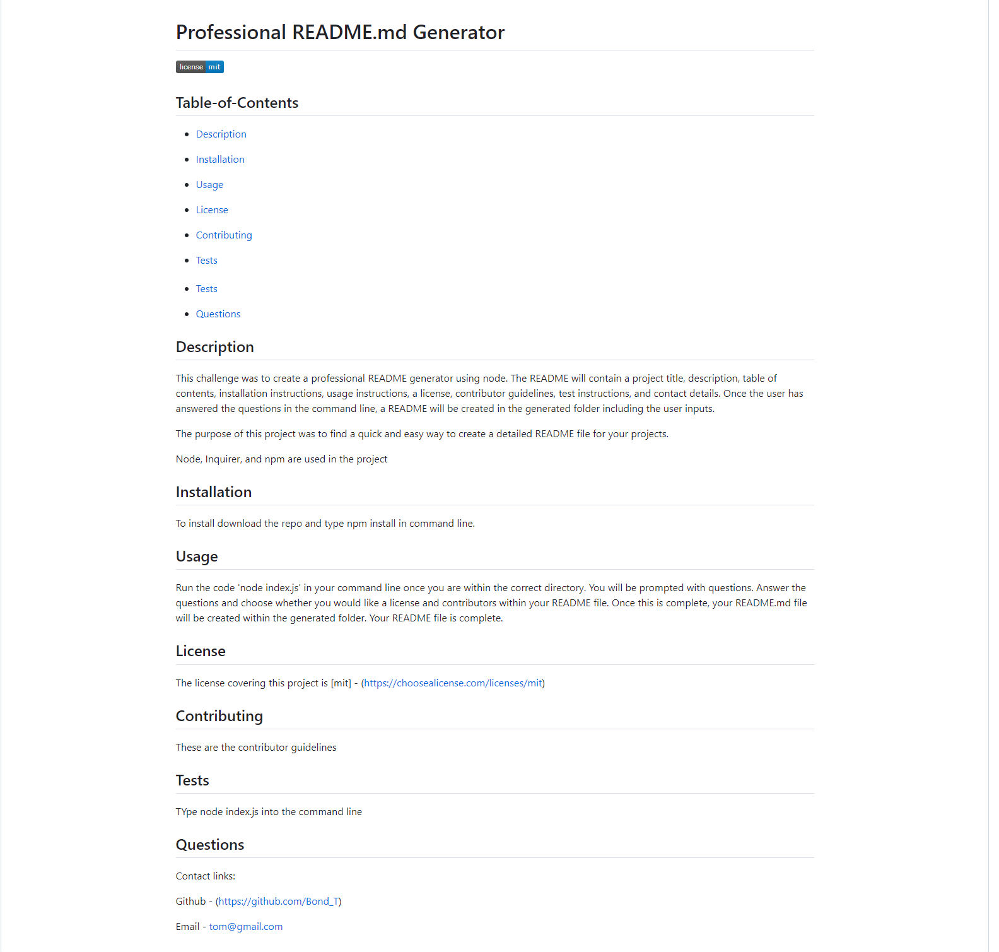

# Professional README Generator

## Description

This challenge was to create a professional README generator using node. The README will contain a project title, description, table of contents, installation instructions, usage instructions, a license, contributor guidelines, test instructions, and contact details. Once the user has answered the questions in the command line, a README will be created in the generated folder including the user inputs. 

The purpose of this project was to find an quick and easy way to create a detailed README file for your projects. 

The features used within this project are:

- Node
- Inquirer 
- npm
- Javascript
- 'if' statements
- functions

## Installation

To install the program, download the files from the repository below.

https://github.com/BondT1/README.md-generator

Next, type 'npm install' in your command line once the files are open in VS Code.

## Usage

Run the code 'node index.js' in your command line once you are within the correct directory. You will be prompted with questions. Answer the questions and choose whether you would like a license and contributors within your README file. Once this is complete, your README.md file will be created within the generated folder. Your README file is complete. 

Use the instructional video below for help. 

https://drive.google.com/file/d/1MKD3_CrwmbHRpRMfdYGZitPFSVbnW3dj/view

A screenshot of the generated README in the video is shown below.

## Credits

N/A